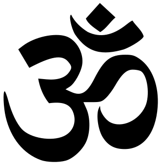

 *"Elegance is not a dispensable luxury, but a quality that decides between success and failure"* - Edsgar Dijkstra

# Open-Machine
Open Machine (Om) is an open source implementation of a UML state machine and actor framework written in C.

